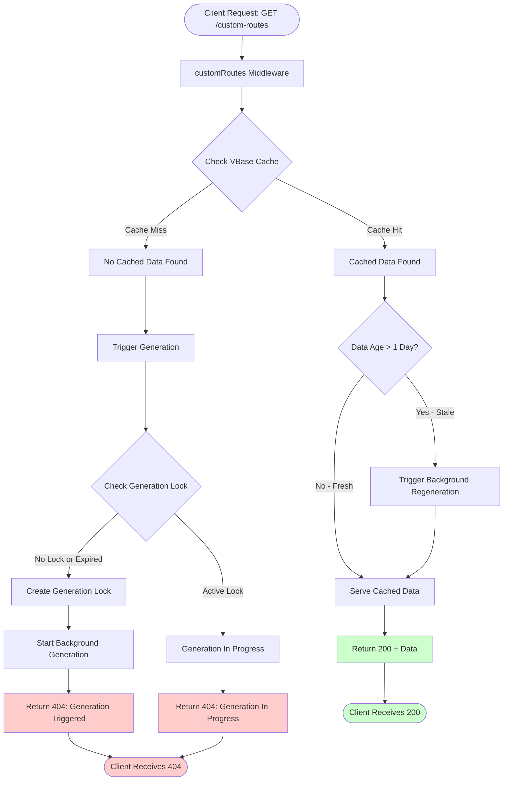
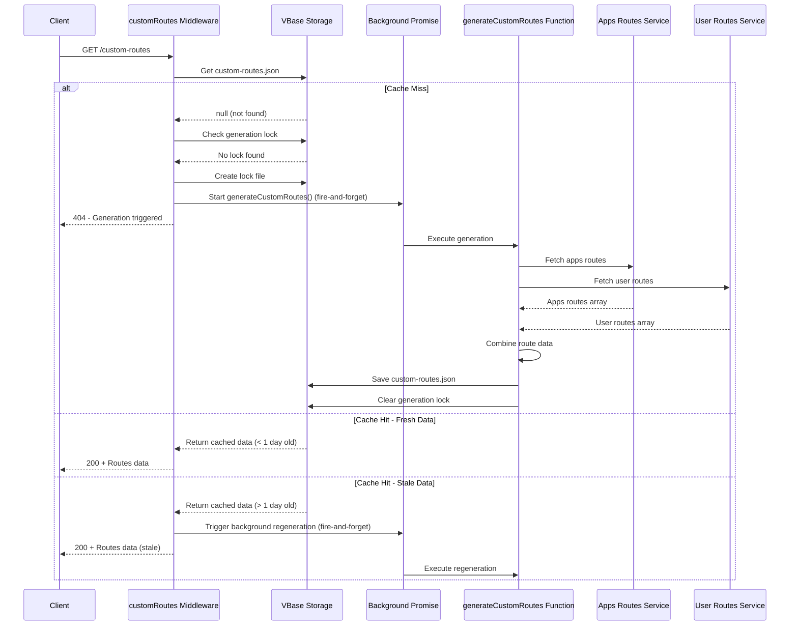
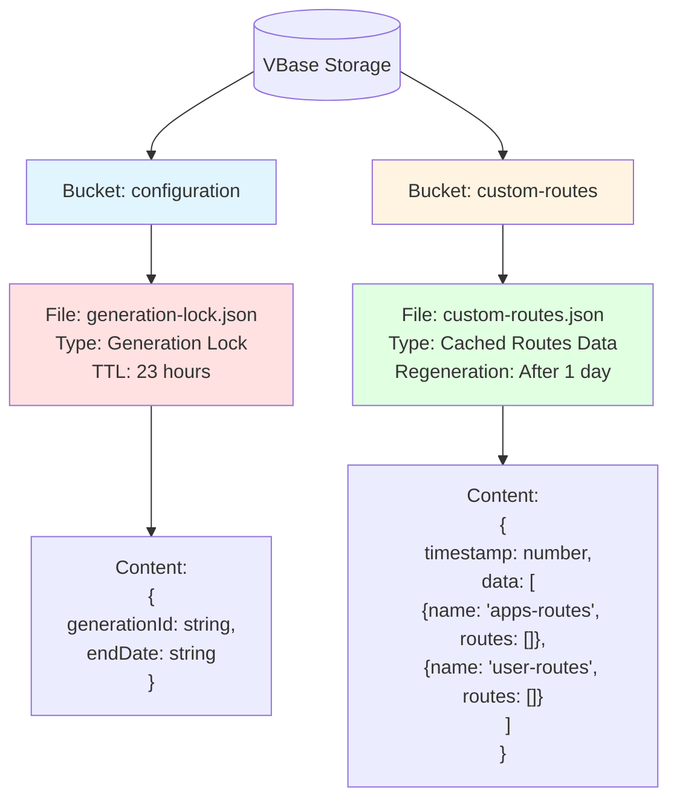

# Custom Routes Architecture

## Overview

The custom routes solution provides pre-generated route data for VTEX stores through a background processing architecture with caching and automatic regeneration.

## System Architecture



## Background Processing Flow



## VBase Storage Structure



## Response Status Codes

| Status | Scenario | Body | Behavior |
|--------|----------|------|----------|
| **200** | Cached data available | `{ data: [...] }` | Returns cached routes (may trigger background refresh if stale) |
| **404** | No cache + Generation triggered | `{ message: "Custom routes not available. Generation has been triggered." }` | New generation started |
| **404** | No cache + Generation in progress | `{ message: "Generation already in progress, expires at {date}" }` | Active lock prevents duplicate generation |
| **500** | Server error | `{ success: false, error: "..." }` | Unexpected error occurred |

## Key Components

### Files

- **`node/middlewares/customRoutes.ts`**: Main middleware handling requests and triggering background generation
- **`node/middlewares/generateMiddlewares/generateCustomRoutes.ts`**: Background generation function
- **`node/utils.ts`**: Shared utilities and constants
- **`node/services/routes.ts`**: Route fetching services

### Constants (from `utils.ts`)

```typescript
export const CUSTOM_ROUTES_BUCKET = 'custom-routes'
export const CUSTOM_ROUTES_FILENAME = 'custom-routes.json'
export const CUSTOM_ROUTES_GENERATION_LOCK_FILENAME = 'generation-lock.json'
export const CONFIG_BUCKET = 'configuration'
```

### Background Generation Mechanism

The generation is triggered directly via a background promise (fire-and-forget pattern):

```typescript
// Execute generation in background - don't await
generateCustomRoutes(ctx).catch(error => {
  logger.error({
    message: 'Background custom routes generation failed',
    type: 'custom-routes-background-error',
    generationId,
    error,
  })
})
```

**Key characteristics:**

- **Direct function call**: No event system overhead
- **Fire-and-forget**: Promise runs in background without blocking response
- **Error handling**: Errors are caught and logged but don't crash the service
- **Synchronous trigger**: Immediate execution without event queue delays

### Generation Lock Mechanism

1. **Lock Creation**: When generation starts, a lock file is created with:
   - `generationId`: Random identifier
   - `endDate`: Expiration timestamp (23 hours from creation)

2. **Lock Check**: Before starting generation:
   - If lock exists and is valid → Reject with `MultipleCustomRoutesGenerationError`
   - If lock expired or doesn't exist → Proceed with generation

3. **Lock Cleanup**: After generation completes (success or failure), lock is removed

4. **Lock Duration Rationale**:
   - **23 hours** chosen to align with daily regeneration schedule
   - Prevents indefinite blocking if cleanup fails
   - Allows next day's scheduled generation to proceed even if previous generation failed

### Caching Strategy

- **Storage**: VBase bucket `custom-routes`, file `custom-routes.json`
- **Structure**: Account-level (not binding-specific)
- **Freshness**: Data older than 1 day triggers background regeneration
- **Stale-While-Revalidate**: Returns stale data while refreshing in background

## Benefits

✅ **Background Processing**: Asynchronous generation doesn't block requests  
✅ **Direct Execution**: No event system overhead or delays  
✅ **Lock Mechanism**: Prevents duplicate concurrent generations with 23-hour auto-expiration  
✅ **Stale-While-Revalidate**: Always serves data when available, refreshes in background  
✅ **Simple Filename**: Single `generation-lock.json` file for lock management  
✅ **Account-Level Caching**: Single `custom-routes.json` per account (not per binding)  
✅ **Centralized Constants**: All configuration in `utils.ts`  
✅ **Consistent Status Codes**: 404 when unavailable, 200 when serving data  
✅ **Daily Generation Safe**: 23-hour lock ensures next day's generation proceeds even if cleanup fails  
✅ **Error Resilience**: Background errors are logged but don't affect service availability
