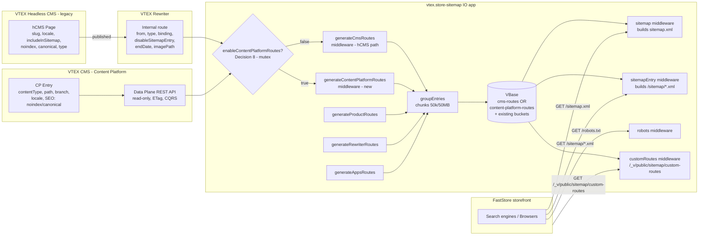

# Include CMS routes in Sitemap generation for FastStore

> **Status**: Done (hCMS legacy) · Draft (Content Platform increment)
> **Created**: 2026-05-27
> **Last updated**: 2026-05-27 — added support for the new VTEX CMS (Content Platform) as a parallel route source
> **Jira**: [SFS-3123](https://vtex-dev.atlassian.net/browse/SFS-3123)
> **PRD**: [Sitemap generation in FastStore](https://docs.google.com/document/d/18QrjAJmGpfLJCW-br5a2Tw-rAvC57biKAl5Z2_4djiM/edit)
> **Related**: [Known Issue — Native sitemap is not fully integrated with FastStore](https://help.vtex.com/known-issues/native-sitemap-is-not-fully-integrated-with-faststore--5IrsqCEtQKPFstqywlV7Nn) · [Headless CMS stores will be upgraded to the new VTEX CMS (Mar 30, 2026)](https://help.vtex.com/announcements/2026-03-30-headless-cms-stores-will-be-upgraded-to-the-new-vtex-cms)

## Assumptions

These assumptions guide this spec; revisit during review if they change.

- **Implementation repo**: `vtex.store-sitemap` (this repo). The IO app is extended to source CMS routes from VTEX Rewriter (hCMS legacy) and from the VTEX CMS Data Plane API (Content Platform), and expose them through the existing `/_v/public/sitemap/*` and `/sitemap*.xml` pipelines that FastStore already consumes. Changes inside the FastStore project (Next.js side) are out of scope of this spec.
- **CMS sources** (both first-party VTEX, in scope):
  - **Headless CMS (hCMS, legacy)** — pages persisted as Rewriter `Internal` entries (the same store of record already used by `generateRewriterRoutes` and `customRoutes`). Source of record for FastStore v1/v2 stores and v3 stores not yet upgraded.
  - **VTEX CMS (Content Platform, new)** — pages stored in the CMS's own CQRS data plane and read through a read-only Data Plane REST API, with native branches, ETag caching and multi-language. Source of record for FastStore v3+ stores being [progressively upgraded since March 2026](https://help.vtex.com/announcements/2026-03-30-headless-cms-stores-will-be-upgraded-to-the-new-vtex-cms).
  - External CMSs (Contentful, etc.) remain out of scope.
  - A store is expected to use **one** of the two VTEX surfaces at a time during the migration window — the two route sources are **mutually exclusive per generation** (see [Decision 8](#decision-8-mutual-exclusivity-between-hcms-legacy-and-content-platform)).
- **Multi-binding/locale strategy** (subfolder vs. subdomain) is owned by the [Multi-bindings Sitemap Support](https://docs.google.com/document/d/12NfWIF9boKgOSh3u4BqwSSJkwB7cm9PG7iBUAJ0QzGQ/edit?tab=t.yfo5oamq0rgl) spec. This document defines only the **shape** of multi-locale output (hreflang/x-default tags per URL entry), not how bindings are resolved.

---

## 1. Business Context

### Problem Statement

Stores running **FastStore** (Next.js storefront) do not have a native, integrated way to generate and keep their `sitemap.xml` up to date. The current solution — the IO Sitemap app (this repo) — was designed for Store Framework with Site Editor and does **not** include pages created via VTEX CMS / hCMS. As a result, merchants resort to manual workarounds with high maintenance cost:

- Combining the IO Sitemap with the `next-sitemap` plugin and custom rewrites in the store repository
- Manually downloading product/category data, running scripts, and editing `sitemap.xml` by hand whenever CMS pages change

Any content change (a new category, product, or CMS page) requires a developer to regenerate and republish the sitemap, creating ongoing overhead and risk of stale sitemaps — which hurts the store's SEO. This is a publicly mapped Known Issue impacting customers like **Hearst, ODP, JW Pepper and Americanas**.

In parallel, a multi-language / multi-currency evolution is underway in FastStore that demands that each URL declare its locale alternates in the sitemap.

On top of that, VTEX is [progressively migrating stores from the Headless CMS (legacy) to the new VTEX CMS — the Content Platform](https://help.vtex.com/announcements/2026-03-30-headless-cms-stores-will-be-upgraded-to-the-new-vtex-cms) — starting March 2026. The Content Platform has a different architecture (CQRS with a read-only Data Plane REST API, Git-like branches, native multi-language) and **does not store pages as Rewriter Internals**. Without explicit support, sitemap coverage regresses for every store that flips to the new CMS. The first wave includes FastStore v3 stores that have already onboarded the new CMS and lost their CMS-page coverage in the sitemap as a result.

### Goals

- FastStore stores expose a single, automatically maintained sitemap that **includes all CMS pages** — sourced from either the **Headless CMS (legacy)** or the new **VTEX CMS (Content Platform)** — alongside framework-generated pages (PDPs, PLPs, landing pages, and any custom-slug page).
- The merchant can **opt a page out of the sitemap from the CMS** without code changes (per-page toggle on hCMS legacy; SEO fields `noindex` / `canonical` on Content Platform — see [Decision 10](#decision-10-content-platform-opt-out-via-seo-fields)).
- The generated sitemap follows the Google sitemap protocol — including `<loc>`, `<lastmod>`, `<changefreq>`, `<priority>`, the **50,000 URL / 50 MB chunking limit**, and a `robots.txt` entry pointing to it.
- For multi-locale stores, each URL declares all locale alternates via `xhtml:link` `hreflang` tags, including `x-default`.
- Eliminate the manual workarounds described in the Problem Statement for the customers listed above and equivalent FastStore tenants.
- **Same FastStore-side experience regardless of CMS surface**: stores being upgraded from hCMS to Content Platform see no regression in sitemap coverage; the contract on `/sitemap.xml`, `/sitemap/*.xml`, `/robots.txt` and `/_v/public/sitemap/custom-routes` is preserved, with only the set name in the JSON response and the file name of the sub-sitemap reflecting the active source (`cms-routes-*` vs. `content-platform-routes-*`).

### User Stories

#### US-1: Merchant — CMS pages appear in the sitemap

- **Story**: As a merchant on FastStore, I want every page I publish in the CMS (PDP, PLP, landing page or custom-slug page) to automatically appear in my store sitemap, so that Google can discover and index it without me editing files. This must hold whether the store uses the legacy Headless CMS or the new VTEX CMS (Content Platform).
- **Acceptance Criteria** (hCMS legacy):
  - **Given** a published hCMS page with a custom slug `/our-story`, **when** the sitemap is regenerated, **then** `https://{store}/our-story` appears as a `<url>` entry in the served sitemap.
  - **Given** a published hCMS-defined PLP at `/black-friday`, **when** the sitemap is regenerated, **then** the URL is present **and** is not duplicated by an automatically generated category URL.
  - **Given** an hCMS page is unpublished or deleted, **when** the next regeneration completes, **then** the URL is removed from the served sitemap.
- **Acceptance Criteria** (Content Platform):
  - **Given** the store has `enableContentPlatformRoutes: true` and a `landingPage` entry is published with `path: /our-story` on the production branch, **when** the sitemap is regenerated, **then** `https://{store}/our-story` appears as a `<url>` entry inside `content-platform-routes-N.xml`.
  - **Given** a Content Platform entry of a **custom content type** that declares a `path` (or equivalent slug) field in its schema, **when** the sitemap is regenerated, **then** its URL is included — i.e., discovery is **schema-driven**, not type-name-driven (see [Decision 9](#decision-9-schema-driven-content-type-discovery)).
  - **Given** a Content Platform entry exists only on a **non-production branch** (e.g., `holiday-campaign`), **when** the sitemap is regenerated, **then** the URL is NOT included.
  - **Given** a Content Platform entry is unpublished or deleted on the production branch, **when** the next regeneration completes, **then** the URL is removed from the served sitemap.

#### US-2: Merchant — Opt a page out of the sitemap

- **Story**: As a merchant, I want a CMS-native way to exclude a specific page from the sitemap, so that I can keep internal/test pages out of search engine indexes without losing the page itself.
- **Acceptance Criteria** (hCMS legacy — dedicated toggle):
  - **Given** an hCMS page where the "Include in sitemap" toggle is **on** (the default), **when** the sitemap is regenerated, **then** the URL is included.
  - **Given** an hCMS page where the toggle is **off**, **when** the sitemap is regenerated, **then** the URL is excluded.
  - **Given** an hCMS page configured with `noindex`, **canonical pointing to a different URL**, or marked as a **login / error page**, **when** the sitemap is regenerated, **then** the URL is excluded regardless of the toggle.
- **Acceptance Criteria** (Content Platform — SEO fields only, no dedicated toggle):
  - **Given** a Content Platform page where the SEO field `noindex: true` is set, **when** the sitemap is regenerated, **then** the URL is excluded.
  - **Given** a Content Platform page where the SEO field `canonical` is set and points to a URL different from the entry's own path, **when** the sitemap is regenerated, **then** the URL is excluded.
  - **Given** a Content Platform page with default SEO fields (`noindex: false`, no `canonical` override), **when** the sitemap is regenerated, **then** the URL is included.
  - **Given** the Content Platform does not currently expose a per-page "Include in sitemap" toggle in the schema (this is by design — see [Decision 10](#decision-10-content-platform-opt-out-via-seo-fields)), **when** an operator wants to hide a single page from the sitemap, **then** the documented path is to set `noindex: true` in that page's SEO tab.

#### US-3: SEO operator — Multi-locale alternates

- **Story**: As an SEO operator for a multi-language store, I want each URL in the sitemap to declare its alternate locale versions, so that Google serves the correct localized URL to each user.
- **Acceptance Criteria**:
  - **Given** a page `/about` exists in locales `en-US`, `pt-BR`, `es-ES`, **when** the sitemap is served, **then** the `<url>` entry for the `en-US` version contains three `<xhtml:link rel="alternate" hreflang="..." href="..."/>` tags — **one for each locale, including itself** — plus one `hreflang="x-default"` pointing to the store's default locale version.
  - **Given** a single-locale store, **when** the sitemap is served, **then** no `<xhtml:link>` tags are emitted.
  - **Given** a page exists only in `en-US`, **when** the sitemap is served, **then** that URL declares no alternates beyond `x-default` (which equals itself).

#### US-4: SEO operator — Spec-compliant sitemap

- **Story**: As an SEO operator, I want the generated sitemap to respect Google's protocol, so that no manual chunking or `robots.txt` edits are needed.
- **Acceptance Criteria**:
  - **Given** the store has more than 50,000 indexable URLs **or** a sub-sitemap would exceed 50 MB, **when** the sitemap is generated, **then** it is automatically chunked into multiple sub-sitemaps referenced by a top-level `<sitemapindex>`.
  - **Given** any `<url>` entry, **when** the sitemap is served, **then** it contains `<loc>`, `<lastmod>`, `<changefreq>` and `<priority>` tags with valid values.
  - **Given** the store has a sitemap, **when** `GET /robots.txt` is served, **then** it contains a `Sitemap: https://{store}/sitemap.xml` directive.

#### US-5: Developer / Integrator — Programmatic access to CMS-included routes

- **Story**: As a FastStore developer building or migrating a store, I want to fetch the list of CMS-backed routes via a public JSON endpoint, so that I can use them in build-time or runtime sitemap composition if needed.
- **Acceptance Criteria**:
  - **Given** the store has hCMS pages and `enableCmsRoutes: true`, **when** I `GET /_v/public/sitemap/custom-routes`, **then** the response includes a section named `cms-routes` (in addition to existing `apps-routes` and `user-routes`).
  - **Given** the store has Content Platform pages and `enableContentPlatformRoutes: true`, **when** I `GET /_v/public/sitemap/custom-routes`, **then** the response includes a section named `content-platform-routes` (in addition to existing `apps-routes` and `user-routes`).
  - **Given** both flags are set to `true` simultaneously, **when** I `GET /_v/public/sitemap/custom-routes`, **then** only `content-platform-routes` is present (Content Platform wins — see [Decision 8](#decision-8-mutual-exclusivity-between-hcms-legacy-and-content-platform)) and the `cms-routes` section is absent for that response.
  - **Given** the response is cached, **when** I make multiple requests within the cache window, **then** I receive the same data without triggering regeneration.

#### US-6: Site operator — Migrate from hCMS to Content Platform without sitemap regression

- **Story**: As a site operator going through the VTEX hCMS → Content Platform upgrade, I want to switch the active source for my sitemap with a single setting flip, so that I get parity in coverage with no manual republishing and no XML editing.
- **Acceptance Criteria**:
  - **Given** the store has `enableCmsRoutes: true` and serves a `<sitemapindex>` referencing `cms-routes-*.xml`, **when** the operator sets `enableContentPlatformRoutes: true` and `enableCmsRoutes: false`, **then** the next successful regeneration serves a `<sitemapindex>` that references `content-platform-routes-*.xml` instead of `cms-routes-*.xml`, with no leftover references to the old files.
  - **Given** both `enableCmsRoutes` and `enableContentPlatformRoutes` are `true`, **when** regeneration runs, **then** Content Platform wins, hCMS ingestion is skipped, and a one-shot structured log `cms-routes-ignored-by-mutual-exclusivity` is emitted per generation cycle.
  - **Given** the operator rolls back by setting `enableContentPlatformRoutes: false` and `enableCmsRoutes: true`, **when** the next regeneration completes, **then** the sitemap reflects the hCMS source again, without manual VBase cleanup.
  - **Given** the operator has both flags `false`, **when** I `GET /_v/public/sitemap/custom-routes`, **then** the response contains only `apps-routes` and `user-routes` (current behavior preserved).

### Key Scenarios

| Scenario | Pre-conditions | Steps | Expected Result |
|---|---|---|---|
| Happy path — hCMS page included | FastStore store with hCMS active and `enableCmsRoutes: true`; merchant publishes `/our-mission` with default toggle | Sitemap regeneration runs (scheduled or triggered) | `/our-mission` appears with `<loc>`, `<lastmod>`, `<changefreq>`, `<priority>` in `cms-routes-N.xml` |
| Happy path — Content Platform landing page included | FastStore v3 store with `enableContentPlatformRoutes: true`; merchant publishes a `landingPage` with `path: /our-mission` on the production branch | Sitemap regeneration runs | `/our-mission` appears with `<loc>`, `<lastmod>`, `<changefreq>`, `<priority>` in `content-platform-routes-N.xml` |
| Happy path — Content Platform custom type with `path` | Content Platform store with a custom type `microsite` whose schema declares a `path` field; entries published on production branch | Sitemap regeneration runs | URLs from `microsite` entries are emitted alongside `landingPage` entries (schema-driven discovery — see [Decision 9](#decision-9-schema-driven-content-type-discovery)); a `content-platform-new-routable-type` log is emitted on first sight of the new type |
| Happy path — Multi-locale page | Store with `en-US` (default), `pt-BR`, `es-ES`; page `/about` exists in all three | Sitemap is served | `<url>` entry contains 3 `<xhtml:link>` alternates + 1 `x-default` |
| Error — Canonical to external URL | CMS page `/promo-old` has canonical → `/promo-new` (works for both sources) | Sitemap regeneration runs | `/promo-old` is excluded; `/promo-new` is included (if eligible) |
| Error — Rewriter unavailable (hCMS path) | Rewriter GraphQL is failing during generation | Sitemap regeneration is triggered | Generation retries (per existing `listInternalsWithRetry`), logs `cms-routes-generation-error`, and falls back to the **previous successful sitemap**; served XML does not regress to empty |
| Error — Content Platform Data Plane outage | Content Platform Data Plane returns 5xx during generation; `enableContentPlatformRoutes: true` | Sitemap regeneration runs | Client retries with exponential backoff; on persistent failure, logs `content-platform-routes-generation-error`, the **previous successful** `content-platform-routes-*.xml` is kept; served XML does not regress |
| Error — Both flags ON | `enableCmsRoutes: true` AND `enableContentPlatformRoutes: true` | Sitemap regeneration runs | Content Platform wins; `cms-routes-*.xml` is NOT emitted nor referenced in the index for this generation; a single `cms-routes-ignored-by-mutual-exclusivity` log is emitted per generation cycle |
| Edge — Chunking boundary (>50k URLs) | Store has 120,000 indexable URLs | Sitemap regeneration runs | Top-level `<sitemapindex>` references three sub-sitemap files (`50k + 50k + 20k`), all linked from `/sitemap.xml`; `robots.txt` references the index |
| Edge — Toggle off + multi-locale (hCMS) | `/secret` toggle is off in locale `en-US` only | Sitemap is served | `/secret` is fully excluded across all locales (a page hidden in any locale is treated as not-in-sitemap for all alternates) |
| Edge — Content Platform branch isolation | Content Platform has a draft branch `holiday-campaign` with 50 new landing pages not yet merged to production | Sitemap regeneration runs | Only entries published on the production branch appear; draft-branch pages are absent (see [Decision 7](#decision-7-content-platform-data-plane-as-a-parallel-source)) |
| Edge — Content Platform locale fidelity | Content Platform `landingPage` exists in `en-US` only; store has `en-US` + `pt-BR` with runtime fallback `pt-BR → en-US` | Sitemap regeneration runs | URL is emitted under `en-US` only; **no** `pt-BR` `<xhtml:link>` alternate is synthesized from the runtime fallback (see [Decision 11](#decision-11-locale-emission-for-content-platform)) |
| Edge — CMS page conflicts with auto route | A CMS page `/p/12345` overrides an auto-generated product URL with same path | Sitemap regeneration runs | A single entry is emitted (deduplicated); CMS metadata (`lastmod`, toggle) takes precedence over the auto-generated one |
| Edge — Content Platform mid-migration rollback | Operator flipped Content Platform on yesterday, today flips it off and hCMS back on | Sitemap regeneration runs | `<sitemapindex>` references `cms-routes-*.xml` again; stale `content-platform-routes-*.xml` files in VBase are no longer referenced and are ignored on serve (cleanup is passive, see [Decision 8](#decision-8-mutual-exclusivity-between-hcms-legacy-and-content-platform)) |

### Functional Requirements

**FR-1 — CMS route ingestion (hCMS legacy)**
The generator MUST source CMS-published routes from VTEX Rewriter Internals whose origin is `hcms` / `cms` and include them in the sitemap together with framework-generated PDPs, PLPs and landing pages.

**FR-2 — Per-page hCMS toggle**
For the **hCMS (legacy) source only**, the CMS MUST surface a boolean configuration field "Include in sitemap" (default `true`) that, when `false`, causes the route to be omitted from the sitemap. The generator MUST honor this flag (mapped onto Rewriter `disableSitemapEntry` or an equivalent attribute — see [Decision 3](#decision-3-cms-toggle--persistence-model)). The Content Platform source uses SEO fields for opt-out instead — see [FR-11](#fr-11--opt-out-via-seo-fields-content-platform) and [Decision 10](#decision-10-content-platform-opt-out-via-seo-fields).

**FR-3 — Mandatory exclusions**
The generator MUST exclude (for both CMS sources):
- Pages classified as login pages
- Pages declaring `noindex` (robots meta or page setting / SEO field)
- Pages whose canonical URL points to a **different** URL
- Pages classified as error pages (e.g., `notFound*`)

**FR-4 — Multi-locale alternates**
For each indexable URL in a multi-locale store, the generator MUST emit one `<xhtml:link rel="alternate" hreflang="{locale}" href="{href}"/>` per locale version (including the URL itself) **and** one `<xhtml:link rel="alternate" hreflang="x-default" href="{defaultHref}"/>` pointing to the store's default locale version.

**FR-5 — Sitemap protocol tags**
Each `<url>` entry MUST contain `<loc>`, `<lastmod>`, `<changefreq>` and `<priority>` with valid values per [sitemaps.org/protocol](https://www.sitemaps.org/protocol.html).

**FR-6 — Chunking**
The generator MUST split content into multiple sub-sitemap files whenever a single file would exceed **50,000 URLs** or **50 MB uncompressed**, exposing them through a top-level `<sitemapindex>` at `/sitemap.xml`.

**FR-7 — `robots.txt` integration**
The `/robots.txt` served by this app MUST contain a `Sitemap:` directive pointing to the canonical `https://{host}/sitemap.xml` for the current binding.

**FR-8 — Public JSON endpoint**
The existing `/_v/public/sitemap/custom-routes` endpoint MUST expose CMS-backed routes alongside the current `apps-routes` and `user-routes` sections. The CMS section's `name` reflects the active source: `cms-routes` (hCMS) or `content-platform-routes` (Content Platform); at most one is present per response (see [FR-10](#fr-10--source-mutual-exclusivity)).

**FR-9 — Content Platform route ingestion**
The generator MUST be able to source routes from the **VTEX CMS Data Plane REST API** (Content Platform) as an alternative to the hCMS source. Ingestion MUST:
- Read only entries on the store's **production branch** (the published/live branch); preview, draft, and feature branches are never read for sitemap purposes.
- **Discover ingestable content types schema-first**: for each content type registered in the store, inspect its schema and ingest entries from every type whose schema declares a `path` (or store-configured equivalent slug) field. Type-name allowlists are explicitly NOT used (see [Decision 9](#decision-9-schema-driven-content-type-discovery)).
- Materialize one `<url>` entry per published entry × per locale where the entry is actually published (no synthetic fallback locales — see [Decision 11](#decision-11-locale-emission-for-content-platform)).
- Use **ETag-based caching** (`If-None-Match`) on Data Plane reads to skip rewriting VBase entries when content has not changed.

**FR-10 — Source mutual exclusivity**
At most one CMS source MUST be active per generation. When both `enableCmsRoutes` (hCMS legacy) and `enableContentPlatformRoutes` (new CMS) are `true` simultaneously, the **Content Platform source wins**, hCMS ingestion is skipped for that generation, no `cms-routes-*.xml` is emitted nor referenced in the `<sitemapindex>`, and a structured log entry `cms-routes-ignored-by-mutual-exclusivity` is emitted exactly once per generation cycle. See [Decision 8](#decision-8-mutual-exclusivity-between-hcms-legacy-and-content-platform).

**FR-11 — Opt-out via SEO fields (Content Platform)**
For Content Platform entries, exclusion from the sitemap MUST be driven exclusively by the SEO fields already exposed by the CMS schema:
- `noindex: true` → excluded
- `canonical` set to a URL different from the entry's own → excluded
The generator MUST NOT require a new per-page toggle in the Content Platform schema; SEO is the contract (see [Decision 10](#decision-10-content-platform-opt-out-via-seo-fields)).

### Non-Functional Requirements

- **Performance**: Full regeneration for a store with 100k URLs and 3 locales completes within the existing background-generation budget (target: ≤ 30 min, matching today's documented ≈ 30 min for 60k products). No additional synchronous load on the sitemap serve path. **Content Platform parity**: the Data Plane's read-optimization (CQRS) plus ETag caching is expected to make the Content Platform path at least as fast as the hCMS one for an equivalent catalog.
- **Cacheability**: Served XML continues to honor existing cache-control rules (long cache control for the `customRoutes` route, public for `robots`). The CMS toggle / SEO-field changes propagate at most within the existing generation cadence (≤ 1 day stale window, mirroring the `customRoutes` cache).
- **ETag caching (Content Platform)**: The Data Plane client MUST send `If-None-Match` on subsequent reads of the same content list and skip rewriting VBase entries on `304 Not Modified` responses.
- **Reliability**: Generation failures MUST NOT cause the served sitemap to regress to empty; the previous successful version remains available until a new one is produced (current VBase-cached behavior). This applies to both the hCMS and Content Platform paths independently.
- **Observability**: Every regeneration emits structured logs and metrics: counts per source (hCMS, Content Platform, product, navigation, apps), exclusion counters per reason (`noindex`, `canonical-mismatch`, `login`, `error`, `toggle-off`), chunking outcome, and (Content Platform only) ETag hit ratio and per-content-type entry counts.
- **Locale fidelity (Content Platform)**: locale alternates are emitted **only for locales where the entry actually has published content**. The generator does not synthesize fallback URLs under a different locale's prefix even if the FastStore runtime would serve fallback content for that locale.
- **Backwards compatibility**: Existing consumers of `/sitemap.xml`, `/sitemap/*.xml`, `/robots.txt`, and `/_v/public/sitemap/custom-routes` MUST continue to work without contract-breaking changes. Both CMS-source additions are additive (new array entries, new sub-sitemap files); existing entry shapes are not modified.
- **Security**: hCMS uses existing Rewriter / GraphQL apps (no new outbound policies). Content Platform requires a new outbound-access policy in `manifest.json` for the VTEX CMS Data Plane host; no inbound surface is added.

### Out of Scope

- Multi-locale support for **non-CMS, framework-generated routes** (PDP/PLP/department auto-routes) — owned by the Store Framework Multi-bindings work referenced in the PRD.
- Image and video sub-sitemaps.
- Gzip compression of sitemap files.
- Changes to the FastStore Next.js project (`next-sitemap` removal, rewrites cleanup, etc.) — only the IO-side API changes.
- A new admin UI inside the IO app for sitemap content (configuration continues to live in the CMS and in the existing settings schema).
- Migration tooling for stores currently using the `next-sitemap` workaround.
- Reading **non-production branches** of the Content Platform (preview / draft / feature branches are explicitly excluded — sitemaps are for production crawlers).
- Adding new fields to the Content Platform schema — opt-out relies on existing SEO fields (`noindex`, `canonical`) per [Decision 10](#decision-10-content-platform-opt-out-via-seo-fields). A dedicated `includeInSitemap` toggle is not pursued.
- **Parallel ingestion of both VTEX CMSs** in the same generation. The two sources are mutually exclusive per [Decision 8](#decision-8-mutual-exclusivity-between-hcms-legacy-and-content-platform); side-by-side coverage during long migrations is explicitly deferred.
- Content migration between hCMS and the Content Platform — handled by the CMS team's upgrade flow described in the [announcement](https://help.vtex.com/announcements/2026-03-30-headless-cms-stores-will-be-upgraded-to-the-new-vtex-cms).

---

## 2. Arch Decisions

### Proposed Solution

Extend the existing `vtex.store-sitemap` IO app to treat **CMS-published routes as a first-class route source**, alongside the current product, navigation and apps sources. Concretely:

1. **hCMS source layer** — Add a `generateCmsRoutes` middleware (sibling to `generateRewriterRoutes`/`generateAppsRoutes`/`generateProductRoutes`) that fetches CMS-origin Rewriter Internals and stores them in a dedicated VBase bucket using the existing `SitemapEntry`/`SitemapIndex` shape. CMS pages already flow through Rewriter today (the same mechanism that backs `generateRewriterRoutes`), so the change is primarily about **classifying, filtering and enriching** those entries rather than fetching from a new system. If hCMS exposes additional metadata (canonical, noindex, login/error flags, `includeInSitemap` toggle) that Rewriter does not currently carry, those fields are materialized at generation time via a thin hCMS client (see [Decision 3](#decision-3-cms-toggle--persistence-model)).
2. **Content Platform source layer** — Add a parallel `generateContentPlatformRoutes` middleware that reads from the **VTEX CMS Data Plane REST API** via a new `cmsDataPlane` client. The middleware: (a) resolves the store's **production branch** identifier once per generation and pins all reads to it; (b) lists registered content-type schemas and selects every schema that declares a `path` (or store-configured equivalent) field — **schema-driven discovery**, see [Decision 9](#decision-9-schema-driven-content-type-discovery); (c) iterates published entries × locales, honoring SEO fields (`noindex`, `canonical`) for opt-out, see [Decision 10](#decision-10-content-platform-opt-out-via-seo-fields); (d) writes a dedicated `content-platform-routes_*` VBase bucket using the same `SitemapEntry` shape as hCMS. ETag (`If-None-Match`) caching is used end-to-end to skip work when content is unchanged.
3. **Source selection** — The two CMS sources are **mutually exclusive per generation** (see [Decision 8](#decision-8-mutual-exclusivity-between-hcms-legacy-and-content-platform)). When both flags are `true`, Content Platform wins; the hCMS middleware is skipped and a structured log is emitted. From the bucket-write step downstream, the served XML, `<sitemapindex>` composition, multi-locale `xhtml:link` emission, chunking, and `robots.txt` directive are **shared** between the two source paths — only the upstream ingestion differs.
4. **Entry shape** — Reuse the `URLEntry` builder in `sitemapEntry.ts` and extend it to emit `<changefreq>`, `<priority>` and a full `xhtml:link` alternate set including `x-default`. Today only a partial alternate set is emitted (and only when the binding differs from the current one).
5. **Index layer** — Use the existing `<sitemapindex>` composition (`sitemap.ts`) to glue the active CMS source's index (either `cms-routes` or `content-platform-routes`) into the served `/sitemap.xml`. The 50k / 50 MB chunking rule replaces the current per-entity `5k` limit for CMS entries.
6. **Public endpoint** — Augment the `customRoutes` middleware response with a `cms-routes` OR `content-platform-routes` section (whichever is active). The shape is **additive** (new entry in the existing array), preserving backwards compatibility.
7. **`robots.txt`** — Add a single `Sitemap:` directive at the end of the served `robots.txt` (or merge into existing per-binding overrides). Avoid duplicates when the merchant already added one. This path is independent of the active CMS source.

The current cache (1 day fresh / 23 h lock) and stale-while-revalidate semantics documented in [`docs/CUSTOM_ROUTES_ARCHITECTURE.md`](../docs/CUSTOM_ROUTES_ARCHITECTURE.md) are reused as-is for both sources.

### Architecture Overview



### Alternatives Considered

| Alternative | Pros | Cons | Verdict |
|---|---|---|---|
| **Generate sitemap entirely client-side in FastStore (via `next-sitemap`)** | No IO changes; lives next to the storefront codebase | Reproduces today's manual workaround; requires storefront developers per change; can't easily incorporate Rewriter/Apps routes; no central caching | Rejected — recreates the original problem |
| **Standalone microservice for FastStore sitemap** | Clean separation; can be optimized for FastStore | Re-implements infrastructure already present here (VBase caching, locking, Rewriter integration, multi-binding, robots); fragments the contract | Rejected — duplication and ops cost |
| **Extend `vtex.store-sitemap` (this proposal)** | Reuses caching, locking, multi-binding logic, `customRoutes` endpoint, robots; already serves IO traffic for FastStore stores | Couples FastStore evolution to an IO app currently shared with Store Framework | **Accepted** — lowest risk, highest reuse |
| **Source CMS directly via hCMS API (bypass Rewriter)** | Single source of truth for CMS metadata (`noindex`, canonical, toggle) | Bypasses Rewriter's existing publish/translate/multi-binding plumbing; duplicates URL resolution logic | Partially accepted — Rewriter is the primary source for hCMS; hCMS API is queried only for metadata fields Rewriter does not carry (see [Decision 3](#decision-3-cms-toggle--persistence-model)) |
| **Force Content Platform to publish into Rewriter so we reuse `generateCmsRoutes` 1:1** | Zero new code in this app; reuses existing pipeline as-is | Forces the new CMS to mirror content into Rewriter Internals — the whole architectural shift of Content Platform is to avoid that monolithic dependency; not on the CMS team's roadmap | Rejected — fights the platform direction |
| **Run hCMS and Content Platform sources in parallel with URL-level dedup** | Smooth transition window for stores mid-migration; no flag-flip cliff | Doubles generation work; ambiguous source-of-truth for the same path; complicates `lastmod` precedence; harder to reason about / log | Rejected for v1 — mutual exclusivity is simpler and predictable (see [Decision 8](#decision-8-mutual-exclusivity-between-hcms-legacy-and-content-platform)); revisit only if real customer demand emerges |
| **Hardcode a Content Platform content-type allowlist (`landingPage`, `home`)** | Simplest implementation; no schema introspection needed | Doesn't accommodate custom content types created by stores (Content Platform actively encourages them); breaks for stores that rename or extend types; requires an app release every time a customer adds a new routable type | Rejected — schema-driven discovery (any type with a `path` field, see [Decision 9](#decision-9-schema-driven-content-type-discovery)) is only marginally more work and future-proof |

### Risks & Mitigations

| Risk | Impact | Likelihood | Mitigation |
|---|---|---|---|
| Sitemap explosion (CMS adds tens of thousands of pages) | Medium | Medium | Reuse `groupEntries`-style chunking with 50k/50 MB limits; emit metrics on counts; document a cap warning |
| Rewriter pagination timeouts during generation | High | Low–Medium | Already mitigated by `listInternalsWithRetry`; extend retry to the CMS-metadata fetch path and keep fallback to previous successful VBase entry |
| Duplicate URLs between CMS and auto-generated sources | Medium | Medium | Deduplicate by canonical URL during `groupEntries`; CMS metadata wins ties (see [Decision 4](#decision-4-deduplication-and-precedence)) |
| Backwards-incompatible change to `customRoutes` response | High | Low | Add `cms-routes` / `content-platform-routes` as **new** entries in the existing array; do not modify shape of existing entries |
| Multi-locale alternate explosion (Cartesian growth with locales × URLs) | Medium | Low–Medium | Cap alternate-set generation to declared store locales (not arbitrary CMS locales); skip alternates for single-locale stores |
| `disableRoutesTerm` interaction (existing substring exclude) | Low | Low | Apply the existing `disableRoutesTerm` to both CMS sources, for consistency with `generateRewriterRoutes` |
| `robots.txt` duplicate Sitemap entries | Low | Medium | Detect existing `Sitemap:` directives in custom robots (per-binding) before appending |
| Content Platform Data Plane schema discovery drift (a new `path`-bearing type appears in production unannounced) | Medium | Medium | Schema-driven discovery picks it up automatically; emit a `content-platform-new-routable-type` log on first sight so operators are aware |
| Content Platform branch contamination (a draft/feature branch is accidentally promoted or aliased to production) | Medium | Low | Always query the Data Plane with an explicit production-branch identifier resolved once per generation; never default to "latest branch"; log the resolved branch ID per generation |
| Both flags set after a botched config rollout | Low | Medium | Mutual exclusivity is enforced server-side, not in UI; behavior is deterministic and logged ([FR-10](#fr-10--source-mutual-exclusivity)) |
| Content Platform locale fallback misinterpretation (emitting a URL under `pt-BR` when only `en-US` is published) | Medium | Medium | Treat the Data Plane response per-locale verbatim; do not synthesize fallback URLs from the storefront's runtime fallback rules ([Decision 11](#decision-11-locale-emission-for-content-platform)) |
| Content Platform Data Plane outage during a long migration window | High | Low | ETag short-circuits mean most reads are cheap; on persistent 5xx, keep previous successful VBase entries (no regression to empty); emit `content-platform-routes-generation-error` log |
| Operator confusion about which source is active | Low | Medium | `/_v/public/sitemap/custom-routes` response makes the active source self-describing (`cms-routes` vs. `content-platform-routes`); per-generation logs name the active source explicitly |

### Key Decisions

#### Decision 1: New route source plugged into the existing pipeline (vs. a parallel sitemap pipeline)

- **Status**: Accepted
- **Context**: We need to add CMS pages to the sitemap. We could either add a new source to the existing pipeline (`generateProductRoutes`, `generateRewriterRoutes`, `generateAppsRoutes`) or build a separate "FastStore sitemap" pipeline.
- **Decision**: Add a new source — `generateCmsRoutes` — to the existing pipeline. It writes a dedicated VBase bucket using the established `SitemapEntry` / `SitemapIndex` shape, and is composed into `/sitemap.xml` via the same `<sitemapindex>` logic.
- **Consequences**: Maximum reuse of caching, locking, multi-binding handling, observability and security policies. The trade-off is that FastStore-specific behavior must coexist with Store Framework behavior in the same code; we manage this via clear file boundaries and feature flags in the settings schema.

#### Decision 2: Reuse the `<sitemapindex>` chunking model for the 50k / 50 MB limit

- **Status**: Accepted
- **Context**: Today, sitemap entries are split per entity type with a per-file limit of 5,000 routes (see README). Google allows up to 50,000 URLs or 50 MB per file. We need to honor that explicitly.
- **Decision**: Continue producing one file per entity bucket, but raise the per-file budget to Google's protocol limit (50,000 URLs **or** 50 MB serialized, whichever is hit first). The `groupEntries` step splits oversized buckets into numbered files (`cms-routes-1.xml`, `cms-routes-2.xml`, …) and references all of them from the top-level index.
- **Consequences**: Fewer HTTP round-trips for crawlers; bigger XML payloads per file. Existing 5k-per-file behavior for product/navigation/apps may need to be revisited for consistency, but that's outside this spec.

#### Decision 3: CMS toggle — persistence model

- **Status**: Accepted
- **Context**: The merchant-visible "Include in sitemap" toggle (default `true`) must be readable by the generator. Today, Rewriter `Internal` already carries `disableSitemapEntry`, populated for legacy Store Framework routes. Surfacing the toggle in the CMS UI and the additional metadata fields (`noindex`, canonical, login/error classification) requires a coordinated change in the hCMS team's surface.
- **Decision**: Reuse `disableSitemapEntry` as the **wire** for the toggle. The CMS UI writes to Rewriter (the existing CMS-publish path) and sets `disableSitemapEntry = !includeInSitemap`. Additional metadata that Rewriter does not yet carry — `noindex`, `canonical` (when pointing to a different URL), explicit `login`/`error` classification — is fetched from hCMS at generation time and joined by Rewriter `id`. The hCMS UI change and the metadata endpoint contract are tracked as **dependencies on the hCMS team** but do not gate the start of P1; the generator ships defensively (treats missing metadata as "not excluded" and `includeInSitemap = true`) until those fields land.
- **Consequences**: Avoids a new column/index in Rewriter for FastStore-specific data; keeps the generator's primary loop dependent on Rewriter only. The metadata join introduces a per-page hCMS read during generation — mitigated by batching and the daily generation cadence. Carries a cross-team dependency that must be tracked alongside this spec (separate Jira link to be added once the hCMS counterpart ticket is filed).

#### Decision 4: Deduplication and precedence

- **Status**: Accepted
- **Context**: A CMS-defined PLP and an auto-generated category page may resolve to the same URL.
- **Decision**: After all sources produce their entries, `groupEntries` deduplicates by **final URL** (taking the binding/locale into account). When a duplicate is found, the CMS-origin entry wins (its `lastmod`, toggle and metadata are used) because it represents an explicit editorial choice.
- **Consequences**: Predictable behavior; no double-listing in Google. CMS authors can override auto-routes by republishing through the CMS.

#### Decision 5: Multi-locale shape (hreflang + x-default)

- **Status**: Accepted
- **Context**: The existing `URLEntry` emits `<xhtml:link>` only for alternates that belong to a **different** binding than the current one, and never emits `x-default`. The ticket requires the full set including self and `x-default`.
- **Decision**: Update `URLEntry` so that, when more than one matching binding has the same `targetProduct` (i.e., a multi-locale store), it emits **one `<xhtml:link>` per locale including self** and one `hreflang="x-default"` pointing to the default binding's canonical URL.
- **Consequences**: Slightly larger XML per entry, but aligned with [Google's recommendation](https://developers.google.com/search/docs/specialty/international/localized-versions#example_2). Single-locale stores emit zero alternates (behavior preserved).

#### Decision 6: `robots.txt` Sitemap directive

- **Status**: Accepted
- **Context**: The current `robots` middleware serves robots content from an app's `build.json` (per binding) and falls back to a legacy source. It does not guarantee a `Sitemap:` directive.
- **Decision**: The `robots` middleware appends `Sitemap: https://{host}/sitemap.xml` to the served body if one is not already present. The check is case-insensitive and stripped of trailing whitespace.
- **Consequences**: Merchants who already declared their sitemap manually are unaffected; everyone else gets it for free. No new VBase write.

#### Decision 7: Content Platform Data Plane as a parallel source

- **Status**: Accepted
- **Context**: The new VTEX CMS (Content Platform) does NOT persist pages in Rewriter Internals. Its CQRS architecture exposes a dedicated read-only **Data Plane REST API** that is the platform-blessed path for read workloads, with native ETag caching, branches and multi-language. Reading via Rewriter would force the CMS team to mirror content back into Rewriter — opposite of the platform's direction.
- **Decision**: Add a parallel `generateContentPlatformRoutes` middleware that reads from the Content Platform's Data Plane REST API via a new `cmsDataPlane` client. The middleware pins reads to the store's **production branch**, sends `If-None-Match` based on prior responses, and writes per-binding entries into a `content-platform-routes_*` VBase bucket. The downstream pipeline (chunking, XML serialization, `<sitemapindex>`, `xhtml:link`, robots) is shared with the hCMS path; only the source differs.
- **Consequences**: One additional outbound integration to operate and a new `manifest.json` outbound-access policy for the Data Plane host. Clear separation between legacy and new CMS code paths means either can be removed cleanly once migration completes (timeline owned by the CMS team). ETag caching is expected to make the Content Platform path cheaper than the hCMS path at steady state.

#### Decision 8: Mutual exclusivity between hCMS legacy and Content Platform

- **Status**: Accepted
- **Context**: A store is expected to use exactly one VTEX CMS surface at a time during the upgrade window. Running both sources simultaneously would (a) double the generation work for no real benefit during a migration, (b) emit duplicate `<url>` entries when the same path exists in both surfaces, and (c) require ambiguous tie-breaking for `lastmod` and SEO metadata.
- **Decision**: At most one of `enableCmsRoutes` / `enableContentPlatformRoutes` may take effect per generation. When both are `true`, **Content Platform wins** (it is the platform's forward direction), hCMS ingestion is skipped, and a one-shot structured log `cms-routes-ignored-by-mutual-exclusivity` is emitted per generation cycle. Stale `cms-routes-*.xml` artifacts from a previous run are NOT re-served (the `<sitemapindex>` excludes them) but are not eagerly purged from VBase — they're naturally cleaned up by being overwritten if the operator flips back to hCMS.
- **Consequences**: Predictable, simple operator mental model: "flip flag, regenerate, see results." Trade-off: stores genuinely needing parallel coverage during a long migration window have to wait for a future enhancement (explicitly deferred — see Out of Scope). Easy to lift later if customer demand emerges, by switching the resolution rule from "wins" to "merge with dedup."

#### Decision 9: Schema-driven content-type discovery

- **Status**: Accepted
- **Context**: Content Platform actively encourages stores to define custom content types beyond the predefined `landingPage` / `home` / `pdp` / `plp` / `search` (e.g., `microsite`, `campaign`, `gift-guide`, `editorial`). A hardcoded type-name allowlist would silently drop those, defeating one of the platform's main selling points and forcing an app release for every new routable type.
- **Decision**: At generation time, inspect the store's registered Content Platform schemas (via the Data Plane API) and ingest entries from **every content type whose schema declares a `path` (or store-configured equivalent) field**. Hardcoded type-name allowlists are not used. A new routable type is logged on first sight (`content-platform-new-routable-type`). PDP / PLP / search Content Types are explicitly excluded from this ingestion — their URLs come from the catalog pipelines (`generateProductRoutes`, `generateRewriterRoutes`); the Content Platform entries for those types are page templates, not addressable URLs.
- **Consequences**: Generation discovers schema changes automatically; no app upgrade is needed when a store adds a new content type. Trade-off: a typo or misconfiguration in a custom schema (e.g., declaring `path` on an internal-only type) could silently include unintended URLs — operators should validate their schemas via the FastStore CLI (`vtex content upload-schema`) before activating the flag.

#### Decision 10: Content Platform opt-out via SEO fields

- **Status**: Accepted
- **Context**: hCMS legacy uses the `disableSitemapEntry` Rewriter flag for per-page sitemap opt-out (Decision 3). Content Platform does not have that flag, and the CMS team is not planning to add one — they consider opt-out to be SEO semantics, not a separate concern. Content Platform already exposes SEO fields per entry (`noindex`, `canonical`, `title`, `description`).
- **Decision**: For the Content Platform source, exclusion from the sitemap is driven **exclusively by the existing SEO fields** already in the schema: `noindex: true` excludes the entry; `canonical` pointing to a URL different from the entry's own path excludes the entry. The login / error classifications also apply where the schema exposes them. **No new schema field is required.** Operators wanting to hide a single page set `noindex: true` in that page's SEO tab.
- **Consequences**: Zero cross-team dependency on the CMS team to ship this feature, and aligned with standard SEO semantics (a page that's `noindex` shouldn't be in the sitemap anyway). Trade-off: an operator who wants a page indexed by Google but **not** listed in the sitemap has no granular control — this is a deliberate simplification consistent with sitemaps.org's spec.

#### Decision 11: Locale emission for Content Platform

- **Status**: Accepted
- **Context**: Content Platform has native multi-language with **runtime fallback rules** (e.g., when `pt-BR` is missing, serve `en-US` content under the `pt-BR` URL). Reflecting runtime fallbacks in the sitemap would emit a `pt-BR` URL whose response is actually `en-US` content — confusing/duplicate from a crawler's point of view and not a real localized resource.
- **Decision**: Emit one `<url>` (and one `<xhtml:link>` alternate) per locale where the entry is **actually published in the Data Plane response** for that entry. Do not synthesize alternates from the storefront's runtime fallback rules. The `xhtml:link` alternate set is built only from actually-published locales plus `hreflang="x-default"`.
- **Consequences**: Aligned with Decision 5 (multi-locale shape) and Google's hreflang guidance. Crawler sees the real published surface. Trade-off: locales served by runtime fallback do not get explicit URLs in the sitemap — search engines still reach them via the canonical locale URL and the `hreflang="x-default"` link.

### Implementation Plan

Phased rollout, each phase independently shippable behind the existing settings schema or new boolean flag (`enableCmsRoutes`, `enableContentPlatformRoutes`, both default `false` until validated):

**hCMS legacy track (shipped):**

| Phase | Scope | Outcome |
|---|---|---|
| **P1 — Foundation** | New `generateCmsRoutes` middleware + VBase bucket; classification (`type === 'cms'` or equivalent); reuse the existing `customRoutes` lock/cache. Add `enableCmsRoutes` setting to `manifest.json`. | CMS routes can be generated and inspected via VBase; no impact on served XML yet. |
| **P2 — Public exposure** | Glue `cms-routes` into the served `<sitemapindex>` and expose them in `/_v/public/sitemap/custom-routes`. | FastStore can consume the new section; sitemap reflects CMS pages for opt-in stores. |
| **P3 — Protocol completeness** | Extend `URLEntry` with `<changefreq>`, `<priority>`, full `xhtml:link` set including `x-default`. Raise per-file limit to 50k/50 MB and apply chunking. | Sitemap is spec-compliant per Google protocol. |
| **P4 — `robots.txt` directive + exclusions** | Append `Sitemap:` to robots if missing; honor hCMS metadata for `noindex`, canonical-mismatch, login/error classification. | Mandatory exclusions enforced; SEO operators get robots-integrated discovery. |
| **P5 — Rollout** | Enable `enableCmsRoutes` by default; coordinate with FastStore docs and customer success for Hearst, ODP, JW Pepper and Americanas migration paths. | Replace `next-sitemap` workarounds in customer projects. |

**Content Platform increment (planned):**

| Phase | Scope | Outcome |
|---|---|---|
| **P6 — Content Platform foundation** | New `cmsDataPlane` client (production-branch pinning, ETag caching, retries). New `generateContentPlatformRoutes` middleware. New `enableContentPlatformRoutes` setting in `manifest.json` (default `false`). Schema-driven content-type discovery — types whose schema declares a `path` field are ingested (excluding PDP/PLP/search templates). Per-binding VBase entries written to `content-platform-routes_*` bucket. Outbound-access policy added for the Data Plane host. Mutual exclusivity logic in source selection. | Content Platform routes can be generated and inspected via VBase for opt-in stores; mutual exclusivity is enforced; no impact on served XML yet. |
| **P7 — Content Platform public exposure** | Glue `content-platform-routes` into the served `<sitemapindex>` (replacing `cms-routes` when its flag wins). Expose `{ name: 'content-platform-routes', routes: [...] }` in `/_v/public/sitemap/custom-routes`. Wire `URLEntry` shared path (already extended in P3) and `robots.txt` directive (already shared from P4). Honor SEO-field opt-outs (`noindex`, canonical-mismatch). | FastStore v3 stores on the new CMS get full sitemap coverage with no XML/contract changes. |
| **P8 — Migration enablement + rollout** | Add a "Migrating from hCMS to Content Platform" section in `docs/CMS_ROUTES.md`. Coordinate ops playbook for the flag flip with CMS / Customer Success teams. Track and report on customers being progressively upgraded by the CMS team from Mar 30, 2026. | Customers on the new CMS stop losing sitemap coverage during the migration; opt-in becomes the recommended default for v3 stores. |

A minor-version bump (e.g., `2.19.0`) on P2 and `2.20.0` on P7. A major-version bump only if a backwards-incompatible change is unavoidable (none are currently anticipated — both the hCMS and Content Platform additions are additive to the `customRoutes` response and add new sub-sitemap files without changing existing ones).

---

## 3. Technical Contract

### Data Models

**hCMS route (internal, generator-side)**

```ts
interface CmsRouteEntry {
  id: string                       // Rewriter Internal id (stable per hCMS page)
  path: string                     // e.g. "/about", "/black-friday"
  bindingId: string                // matches Binding.id
  locale: string                   // e.g. "en-US"; derived from binding.defaultLocale
  lastmod: string                  // ISO timestamp, UTC
  changefreq?: ChangeFreq          // see below
  priority?: number                // 0.0 – 1.0, two decimals
  includeInSitemap: boolean        // ! Internal.disableSitemapEntry
  noindex: boolean                 // from hCMS metadata
  canonical?: string               // from hCMS; when present and != path, route is excluded
  classification: 'pdp' | 'plp' | 'landing' | 'cms-custom' | 'login' | 'error' | 'other'
  imagePath?: string
  imageTitle?: string
}

type ChangeFreq =
  | 'always' | 'hourly' | 'daily' | 'weekly'
  | 'monthly' | 'yearly' | 'never'
```

**Content Platform route (internal, generator-side)**

```ts
interface ContentPlatformRouteEntry {
  id: string                       // Content Platform entry id (stable per page)
  contentType: string              // schema $componentKey, e.g. "landingPage", "home", "microsite"
  path: string                     // value of the schema's path field (or store-configured equivalent)
  branch: 'production'             // pinned, see Decision 7
  bindingId: string                // matches Binding.id
  locale: string                   // entry's actually-published locale (no runtime fallback synthesis)
  lastmod: string                  // ISO timestamp from the Data Plane entry
  etag?: string                    // Data Plane ETag, used by the client to short-circuit unchanged reads
  noindex: boolean                 // from SEO fields
  canonical?: string               // from SEO fields; when set and != path, entry is excluded
  loginOrErrorPage?: boolean       // true if schema/entry classifies it as login or error
  changefreq?: ChangeFreq          // default 'weekly'
  priority?: number                // default 0.5
}
```

**Sitemap entry (persisted in VBase, reuses existing `SitemapEntry`)**

```ts
interface SitemapEntry {
  lastUpdated: string
  routes: Route[]   // existing global Route type; extended below
}

interface Route {
  id: string
  path: string
  alternates?: AlternateRoute[]
  imagePath?: string
  imageTitle?: string
  // NEW (additive)
  changefreq?: ChangeFreq
  priority?: number
  lastmod?: string  // overrides SitemapEntry.lastUpdated when set
  source?: 'hcms' | 'content-platform' | 'apps' | 'user'  // for observability/dedup
}
```

**Public `customRoutes` response (additive)**

```ts
type CustomRoutesResponse = Array<
  | { name: 'apps-routes'; routes: string[] }
  | { name: 'user-routes'; routes: string[] }
  | { name: 'cms-routes'; routes: string[] }                // hCMS legacy source (when enableCmsRoutes wins)
  | { name: 'content-platform-routes'; routes: string[] }   // NEW — Content Platform source (when its flag wins)
>
// Invariant per Decision 8: at most ONE of `cms-routes` / `content-platform-routes` is present per response.
```

**App settings (`manifest.json`)**

```ts
interface SitemapSettings {
  // existing
  enableCmsRoutes?: boolean              // hCMS legacy, default false
  // NEW
  enableContentPlatformRoutes?: boolean  // Content Platform, default false
  // see Decision 8: when both true, enableContentPlatformRoutes wins
  // ...other existing settings (disableRoutesTerm, etc.) unchanged
}
```

### Interfaces

**HTTP — served by this app**

| Method | Path | Behavior change |
|---|---|---|
| `GET` | `/sitemap.xml` | Now includes **either** `cms-routes-*.xml` (when `enableCmsRoutes` wins) **or** `content-platform-routes-*.xml` (when `enableContentPlatformRoutes` wins) entries in the top-level `<sitemapindex>`, per the mutual-exclusivity rule of [Decision 8](#decision-8-mutual-exclusivity-between-hcms-legacy-and-content-platform). Each sub-sitemap respects the 50k/50 MB limit. |
| `GET` | `/sitemap/cms-routes-{n}.xml` | **New** sub-sitemap files for hCMS-sourced routes. Each `<url>` carries `<loc>`, `<lastmod>`, `<changefreq>`, `<priority>` and (multi-locale only) the full `xhtml:link` set including `hreflang="x-default"`. Served only when `enableCmsRoutes` is the winning flag. |
| `GET` | `/sitemap/content-platform-routes-{n}.xml` | **New** sub-sitemap files for Content Platform-sourced routes. Same tag shape as `cms-routes-{n}.xml`. Served only when `enableContentPlatformRoutes` is the winning flag. |
| `GET` | `/sitemap/*.xml` | Existing sub-sitemaps gain `<changefreq>` and `<priority>` tags and the extended `xhtml:link` set when the store is multi-locale. |
| `GET` | `/robots.txt` | Adds `Sitemap: https://{host}/sitemap.xml` at the end if not already present. Independent of which CMS source is active. |
| `GET` | `/_v/public/sitemap/custom-routes` | Response array additionally contains **either** `{ name: 'cms-routes', routes: string[] }` **or** `{ name: 'content-platform-routes', routes: string[] }` depending on the active source (mutually exclusive — at most one is present per response). Stores with neither flag enabled get the legacy 2-entry response (`apps-routes` + `user-routes`). |

**Module boundaries — internal**

| Module | Responsibility |
|---|---|
| `node/middlewares/generateMiddlewares/generateCmsRoutes.ts` | Pull hCMS-origin Rewriter Internals, join with hCMS metadata, write per-binding `SitemapEntry` files into a `cms-routes_*` bucket via `getBucket('cms-routes', hashString(binding.id))`. **Skipped at runtime** when `enableContentPlatformRoutes` is true ([FR-10](#fr-10--source-mutual-exclusivity)). |
| `node/middlewares/generateMiddlewares/generateContentPlatformRoutes.ts` (new) | Resolve the production branch identifier once per generation; list registered Content Platform schemas; select schemas with a `path` field (excluding PDP/PLP/search templates); iterate published entries × locales; apply SEO-field opt-out; write per-binding `SitemapEntry` files into a `content-platform-routes_*` bucket via `getBucket('content-platform-routes', hashString(binding.id))`. |
| `node/clients/cmsDataPlane.ts` (new) | Typed client for the VTEX CMS Data Plane REST API. Pins `branch=production`, sends `If-None-Match`, handles `304 Not Modified` by reusing the prior VBase entries unchanged. Retries with exponential backoff on 5xx; surfaces structured `content-platform-routes-generation-error` logs on persistent failure. |
| `node/services/routes.ts` | Add `getCmsRoutes(ctx)` and `getContentPlatformRoutes(ctx)` analogous to `getUserRoutes` / `getAppsRoutes` for use by `generateCustomRoutes` and `customRoutes`. The active-source resolver (`resolveActiveCmsSource(settings) → 'hcms' \| 'content-platform' \| 'none'`) lives here and is shared by every consumer. |
| `node/middlewares/sitemap.ts` | Read the **active** CMS source's index file (`cms-routes` OR `content-platform-routes`) from VBase and append to the `<sitemapindex>`. Stale files from the inactive source are not referenced. |
| `node/middlewares/sitemapEntry.ts` | Extend `URLEntry` with `<changefreq>`, `<priority>`, full alternate set + `x-default`. Path is shared by both CMS sources. |
| `node/middlewares/robots.ts` | Ensure the served body contains a `Sitemap:` directive; idempotent append. Independent of CMS source. |
| `node/middlewares/customRoutes.ts` | Add `cms-routes` OR `content-platform-routes` to the cached payload, based on the active source (uses `resolveActiveCmsSource`). |
| `node/clients/hcms.ts` (new, if needed per [Decision 3](#decision-3-cms-toggle--persistence-model)) | Read hCMS metadata (`noindex`, canonical, `includeInSitemap`, classification) for a batch of page ids. |
| `manifest.json` settings schema | New booleans `enableCmsRoutes` (default `false`, flipped to `true` in P5) and `enableContentPlatformRoutes` (default `false`, flipped to `true` in P8 for upgraded v3 stores). New `outbound-access` policy for the VTEX CMS Data Plane host. |

### Integration Points

- **VTEX Rewriter** (`vtex.rewriter`) — primary source of routes for the hCMS legacy path. Already consumed via `listInternalsWithRetry`. CMS pages are filtered by `type` (CMS-classified) and by `binding`.
- **VTEX hCMS** — secondary source for per-page metadata not currently surfaced by Rewriter Internal. Accessed via the relevant CMS GraphQL/REST endpoints (exact host depends on hCMS API, to be confirmed during P1). New `outbound-access` policy may be required in `manifest.json` if not already covered.
- **VTEX CMS Data Plane (Content Platform)** — **new** read-only REST integration backing `generateContentPlatformRoutes`. Used to (a) list registered schemas (for type discovery), (b) iterate published entries per type/locale on the production branch, (c) read SEO fields. ETag-based caching via `If-None-Match` is mandatory. Requires a new `outbound-access` policy entry in `manifest.json` for the Data Plane host (exact host to be confirmed during P6 against the Content Platform team's published docs).
- **Tenant API** (`@vtex/api` `TenantClient`) — already used for binding/locale discovery. No changes.
- **VBase** — already used. New bucket prefixes `cms-routes` and `content-platform-routes`, each keyed per binding; existing buckets unchanged.
- **`@vtex/api` Logger / Metrics** — emit `cms-routes-generation-*` event types analogous to existing `custom-routes-*`; **new** `content-platform-routes-generation-*` and `content-platform-new-routable-type` events; `cms-routes-ignored-by-mutual-exclusivity` event for the mutual-exclusivity guard.
- **FastStore storefront** — consumes `/sitemap.xml` and `/_v/public/sitemap/custom-routes`; no contract break. Same code on the storefront side works regardless of whether the store is on hCMS or Content Platform.

### Invariants & Constraints

1. **No empty sitemap regression**: if a regeneration fails, `/sitemap.xml` continues to serve the most recent successful version from VBase. This applies independently to both CMS source paths.
2. **Per-file budget**: each sub-sitemap is at most **50,000 URLs** AND at most **50 MB** uncompressed. Exceeding either triggers a new file.
3. **`includeInSitemap` precedence (hCMS)**: a route with `includeInSitemap = false` (from hCMS) or `disableSitemapEntry = true` (from Rewriter) MUST NOT appear in any served sitemap or in `customRoutes`.
4. **Exclusion superseding**: if any mandatory exclusion applies (`noindex`, canonical-mismatch, login, error classification), the route is excluded **regardless** of the merchant toggle / source (i.e., merchant cannot force-include a `noindex` page from either CMS).
5. **Locale completeness**: in a multi-locale store, every emitted `<url>` declares alternates for **every store locale where the page exists**, plus `x-default`. Missing locales are silently omitted (not faked). For Content Platform specifically, runtime fallback is NEVER used to synthesize alternates ([Decision 11](#decision-11-locale-emission-for-content-platform)).
6. **Determinism**: two consecutive successful generations on the same Rewriter+hCMS / Content-Platform-Data-Plane state MUST produce semantically equivalent XML (entry order is not part of the contract, but the set of `<loc>` values is).
7. **Backwards compatibility**: existing `customRoutes` consumers must continue to work; new entry types are additive. Existing `<url>` entries gain `<changefreq>`/`<priority>` (optional in the protocol) without removing or renaming any tag.
8. **`robots.txt` idempotency**: the appended `Sitemap:` directive must not duplicate an existing one (case-insensitive match on the URL).
9. **Settings gating**: when both `enableCmsRoutes` and `enableContentPlatformRoutes` are `false`, the CMS-routes feature behaves as if it did not exist (no extra VBase reads, no extra response keys, no extra XML entries) so that rollout is reversible.
10. **Single active CMS source**: at most one of `enableCmsRoutes` / `enableContentPlatformRoutes` produces emitted XML per generation; when both are `true`, Content Platform wins and hCMS ingestion is skipped ([Decision 8](#decision-8-mutual-exclusivity-between-hcms-legacy-and-content-platform), [FR-10](#fr-10--source-mutual-exclusivity)). The active source is observable in `/_v/public/sitemap/custom-routes` (the section name) and in structured logs.
11. **Production-branch only (Content Platform)**: the Data Plane is always queried with the resolved production-branch identifier. Draft / preview / feature branches never appear in the served sitemap, even transiently.
12. **Schema-driven discovery (Content Platform)**: content types are selected by the presence of a `path` field in their schema, not by hardcoded type names. PDP / PLP / search Content Types are intentionally excluded (their URLs come from catalog pipelines).
13. **ETag respect (Content Platform)**: a `304 Not Modified` response on the Data Plane MUST short-circuit the generation for that scope — no VBase rewrite occurs and the prior `SitemapEntry` is preserved verbatim.
14. **No synthetic locales (Content Platform)**: a `<url>` or alternate is emitted only for locales where the source CMS reports an actually-published version. Runtime locale fallback is not reflected in the sitemap.

