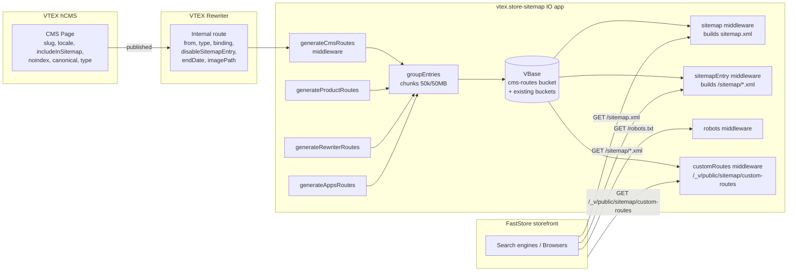

# Include CMS routes in Sitemap generation for FastStore

> **Status**: Draft
> **Created**: 2026-05-27
> **Jira**: [SFS-3123](https://vtex-dev.atlassian.net/browse/SFS-3123)
> **PRD**: [Sitemap generation in FastStore](https://docs.google.com/document/d/18QrjAJmGpfLJCW-br5a2Tw-rAvC57biKAl5Z2_4djiM/edit)
> **Related**: [Known Issue — Native sitemap is not fully integrated with FastStore](https://help.vtex.com/known-issues/native-sitemap-is-not-fully-integrated-with-faststore--5IrsqCEtQKPFstqywlV7Nn)

## Assumptions

These assumptions guide this spec; revisit during review if they change.

- **Implementation repo**: `vtex.store-sitemap` (this repo). The IO app is extended to source CMS routes from VTEX Rewriter and expose them through the existing `/_v/public/sitemap/*` and `/sitemap*.xml` pipelines that FastStore already consumes. Changes inside the FastStore project (Next.js side) are out of scope of this spec.
- **CMS source**: VTEX **headless CMS (hCMS)**, whose pages are persisted as Rewriter `Internal` entries (the same store of record already used by `generateRewriterRoutes` and `customRoutes`). External CMSs (Contentful, etc.) are out of scope.
- **Multi-binding/locale strategy** (subfolder vs. subdomain) is owned by the [Multi-bindings Sitemap Support](https://docs.google.com/document/d/12NfWIF9boKgOSh3u4BqwSSJkwB7cm9PG7iBUAJ0QzGQ/edit?tab=t.yfo5oamq0rgl) spec. This document defines only the **shape** of multi-locale output (hreflang/x-default tags per URL entry), not how bindings are resolved.

---

## 1. Business Context

### Problem Statement

Stores running **FastStore** (Next.js storefront) do not have a native, integrated way to generate and keep their `sitemap.xml` up to date. The current solution — the IO Sitemap app (this repo) — was designed for Store Framework with Site Editor and does **not** include pages created via VTEX CMS / hCMS. As a result, merchants resort to manual workarounds with high maintenance cost:

- Combining the IO Sitemap with the `next-sitemap` plugin and custom rewrites in the store repository
- Manually downloading product/category data, running scripts, and editing `sitemap.xml` by hand whenever CMS pages change

Any content change (a new category, product, or CMS page) requires a developer to regenerate and republish the sitemap, creating ongoing overhead and risk of stale sitemaps — which hurts the store's SEO. This is a publicly mapped Known Issue impacting customers like **Hearst, ODP, JW Pepper and Americanas**.

In parallel, a multi-language / multi-currency evolution is underway in FastStore that demands that each URL declare its locale alternates in the sitemap.

### Goals

- FastStore stores expose a single, automatically maintained sitemap that **includes all CMS/hCMS pages** alongside framework-generated pages (PDPs, PLPs, landing pages, and any custom-slug page).
- The merchant can **opt a page out of the sitemap from the CMS** without code changes.
- The generated sitemap follows the Google sitemap protocol — including `<loc>`, `<lastmod>`, `<changefreq>`, `<priority>`, the **50,000 URL / 50 MB chunking limit**, and a `robots.txt` entry pointing to it.
- For multi-locale stores, each URL declares all locale alternates via `xhtml:link` `hreflang` tags, including `x-default`.
- Eliminate the manual workarounds described in the Problem Statement for the customers listed above and equivalent FastStore tenants.

### User Stories

#### US-1: Merchant — CMS pages appear in the sitemap

- **Story**: As a merchant on FastStore, I want every page I publish in the CMS (PDP, PLP, landing page or custom-slug page) to automatically appear in my store sitemap, so that Google can discover and index it without me editing files.
- **Acceptance Criteria**:
  - **Given** a published CMS page with a custom slug `/our-story`, **when** the sitemap is regenerated, **then** `https://{store}/our-story` appears as a `<url>` entry in the served sitemap.
  - **Given** a published CMS-defined PLP at `/black-friday`, **when** the sitemap is regenerated, **then** the URL is present **and** is not duplicated by an automatically generated category URL.
  - **Given** a CMS page is unpublished or deleted, **when** the next regeneration completes, **then** the URL is removed from the served sitemap.

#### US-2: Merchant — Opt a page out of the sitemap

- **Story**: As a merchant, I want a per-page toggle in the CMS to exclude a specific page from the sitemap, so that I can keep internal/test pages out of search engine indexes without losing the page itself.
- **Acceptance Criteria**:
  - **Given** a CMS page where the "Include in sitemap" toggle is **on** (the default), **when** the sitemap is regenerated, **then** the URL is included.
  - **Given** a CMS page where the toggle is **off**, **when** the sitemap is regenerated, **then** the URL is excluded.
  - **Given** a CMS page configured with `noindex`, **canonical pointing to a different URL**, or marked as a **login / error page**, **when** the sitemap is regenerated, **then** the URL is excluded regardless of the toggle.

#### US-3: SEO operator — Multi-locale alternates

- **Story**: As an SEO operator for a multi-language store, I want each URL in the sitemap to declare its alternate locale versions, so that Google serves the correct localized URL to each user.
- **Acceptance Criteria**:
  - **Given** a page `/about` exists in locales `en-US`, `pt-BR`, `es-ES`, **when** the sitemap is served, **then** the `<url>` entry for the `en-US` version contains three `<xhtml:link rel="alternate" hreflang="..." href="..."/>` tags — **one for each locale, including itself** — plus one `hreflang="x-default"` pointing to the store's default locale version.
  - **Given** a single-locale store, **when** the sitemap is served, **then** no `<xhtml:link>` tags are emitted.
  - **Given** a page exists only in `en-US`, **when** the sitemap is served, **then** that URL declares no alternates beyond `x-default` (which equals itself).

#### US-4: SEO operator — Spec-compliant sitemap

- **Story**: As an SEO operator, I want the generated sitemap to respect Google's protocol, so that no manual chunking or `robots.txt` edits are needed.
- **Acceptance Criteria**:
  - **Given** the store has more than 50,000 indexable URLs **or** a sub-sitemap would exceed 50 MB, **when** the sitemap is generated, **then** it is automatically chunked into multiple sub-sitemaps referenced by a top-level `<sitemapindex>`.
  - **Given** any `<url>` entry, **when** the sitemap is served, **then** it contains `<loc>`, `<lastmod>`, `<changefreq>` and `<priority>` tags with valid values.
  - **Given** the store has a sitemap, **when** `GET /robots.txt` is served, **then** it contains a `Sitemap: https://{store}/sitemap.xml` directive.

#### US-5: Developer / Integrator — Programmatic access to CMS-included routes

- **Story**: As a FastStore developer building or migrating a store, I want to fetch the list of CMS-backed routes via a public JSON endpoint, so that I can use them in build-time or runtime sitemap composition if needed.
- **Acceptance Criteria**:
  - **Given** the store has CMS pages, **when** I `GET /_v/public/sitemap/custom-routes`, **then** the response includes a section listing CMS-backed routes (in addition to existing `apps-routes` and `user-routes`).
  - **Given** the response is cached, **when** I make multiple requests within the cache window, **then** I receive the same data without triggering regeneration.

### Key Scenarios

| Scenario | Pre-conditions | Steps | Expected Result |
|---|---|---|---|
| Happy path — CMS page included | FastStore store with hCMS active; merchant publishes `/our-mission` with default toggle | Sitemap regeneration runs (scheduled or triggered) | `/our-mission` appears with `<loc>`, `<lastmod>`, `<changefreq>`, `<priority>` in the served sitemap |
| Happy path — Multi-locale page | Store with `en-US` (default), `pt-BR`, `es-ES`; page `/about` exists in all three | Sitemap is served | `<url>` entry contains 3 `<xhtml:link>` alternates + 1 `x-default` |
| Error — Canonical to external URL | CMS page `/promo-old` has canonical → `/promo-new` | Sitemap regeneration runs | `/promo-old` is excluded; `/promo-new` is included (if eligible) |
| Error — Rewriter unavailable | Rewriter GraphQL is failing during generation | Sitemap regeneration is triggered | Generation retries (per existing `listInternalsWithRetry`), logs `cms-routes-generation-error`, and falls back to the **previous successful sitemap**; served XML does not regress to empty |
| Edge — Chunking boundary (>50k URLs) | Store has 120,000 indexable URLs | Sitemap regeneration runs | Top-level `<sitemapindex>` references three sub-sitemap files (`50k + 50k + 20k`), all linked from `/sitemap.xml`; `robots.txt` references the index |
| Edge — Toggle off + multi-locale | `/secret` toggle is off in locale `en-US` only | Sitemap is served | `/secret` is fully excluded across all locales (a page hidden in any locale is treated as not-in-sitemap for all alternates) |
| Edge — CMS page conflicts with auto route | A CMS page `/p/12345` overrides an auto-generated product URL with same path | Sitemap regeneration runs | A single entry is emitted (deduplicated); CMS metadata (`lastmod`, toggle) takes precedence over the auto-generated one |

### Functional Requirements

**FR-1 — CMS route ingestion**
The generator MUST source CMS-published routes (Rewriter Internals whose origin is `hcms` / `cms`) and include them in the sitemap together with framework-generated PDPs, PLPs and landing pages.

**FR-2 — Per-page CMS toggle**
The CMS MUST surface a boolean configuration field "Include in sitemap" (default `true`) that, when `false`, causes the route to be omitted from the sitemap. The generator MUST honor this flag (mapped onto Rewriter `disableSitemapEntry` or an equivalent attribute — see [Decision 3](#decision-3-cms-toggle--persistence-model)).

**FR-3 — Mandatory exclusions**
The generator MUST exclude:
- Pages classified as login pages
- Pages declaring `noindex` (robots meta or page setting)
- Pages whose canonical URL points to a **different** URL
- Pages classified as error pages (e.g., `notFound*`)

**FR-4 — Multi-locale alternates**
For each indexable URL in a multi-locale store, the generator MUST emit one `<xhtml:link rel="alternate" hreflang="{locale}" href="{href}"/>` per locale version (including the URL itself) **and** one `<xhtml:link rel="alternate" hreflang="x-default" href="{defaultHref}"/>` pointing to the store's default locale version.

**FR-5 — Sitemap protocol tags**
Each `<url>` entry MUST contain `<loc>`, `<lastmod>`, `<changefreq>` and `<priority>` with valid values per [sitemaps.org/protocol](https://www.sitemaps.org/protocol.html).

**FR-6 — Chunking**
The generator MUST split content into multiple sub-sitemap files whenever a single file would exceed **50,000 URLs** or **50 MB uncompressed**, exposing them through a top-level `<sitemapindex>` at `/sitemap.xml`.

**FR-7 — `robots.txt` integration**
The `/robots.txt` served by this app MUST contain a `Sitemap:` directive pointing to the canonical `https://{host}/sitemap.xml` for the current binding.

**FR-8 — Public JSON endpoint**
The existing `/_v/public/sitemap/custom-routes` endpoint MUST expose CMS-backed routes alongside the current `apps-routes` and `user-routes` sections.

### Non-Functional Requirements

- **Performance**: Full regeneration for a store with 100k URLs and 3 locales completes within the existing background-generation budget (target: ≤ 30 min, matching today's documented ≈ 30 min for 60k products). No additional synchronous load on the sitemap serve path.
- **Cacheability**: Served XML continues to honor existing cache-control rules (long cache control for the `customRoutes` route, public for `robots`). The CMS toggle changes propagate at most within the existing generation cadence (≤ 1 day stale window, mirroring the `customRoutes` cache).
- **Reliability**: Generation failures MUST NOT cause the served sitemap to regress to empty; the previous successful version remains available until a new one is produced (current VBase-cached behavior).
- **Observability**: Every regeneration emits structured logs and metrics: counts per source (CMS, product, navigation, apps), exclusion counters per reason (`noindex`, `canonical-mismatch`, `login`, `error`, `toggle-off`), and chunking outcome.
- **Backwards compatibility**: Existing consumers of `/sitemap.xml`, `/sitemap/*.xml`, `/robots.txt`, and `/_v/public/sitemap/custom-routes` MUST continue to work without contract-breaking changes. The CMS-routes addition is additive.
- **Security**: No new outbound network policies beyond what hCMS access (via Rewriter / existing GraphQL apps) already requires.

### Out of Scope

- Multi-locale support for **non-CMS, framework-generated routes** (PDP/PLP/department auto-routes) — owned by the Store Framework Multi-bindings work referenced in the PRD.
- Image and video sub-sitemaps.
- Gzip compression of sitemap files.
- Changes to the FastStore Next.js project (`next-sitemap` removal, rewrites cleanup, etc.) — only the IO-side API changes.
- A new admin UI inside the IO app for sitemap content (configuration continues to live in the CMS and in the existing settings schema).
- Migration tooling for stores currently using the `next-sitemap` workaround.

---

## 2. Arch Decisions

### Proposed Solution

Extend the existing `vtex.store-sitemap` IO app to treat **CMS-published routes as a first-class route source**, alongside the current product, navigation and apps sources. Concretely:

1. **Source layer** — Add a `generateCmsRoutes` middleware (sibling to `generateRewriterRoutes`/`generateAppsRoutes`/`generateProductRoutes`) that fetches CMS-origin Rewriter Internals and stores them in a dedicated VBase bucket using the existing `SitemapEntry`/`SitemapIndex` shape. CMS pages already flow through Rewriter today (the same mechanism that backs `generateRewriterRoutes`), so the change is primarily about **classifying, filtering and enriching** those entries rather than fetching from a new system. If hCMS exposes additional metadata (canonical, noindex, login/error flags, `includeInSitemap` toggle) that Rewriter does not currently carry, those fields are materialized at generation time via a thin hCMS client (see [Decision 3](#decision-3-cms-toggle--persistence-model)).
2. **Entry shape** — Reuse the `URLEntry` builder in `sitemapEntry.ts` and extend it to emit `<changefreq>`, `<priority>` and a full `xhtml:link` alternate set including `x-default`. Today only a partial alternate set is emitted (and only when the binding differs from the current one).
3. **Index layer** — Use the existing `<sitemapindex>` composition (`sitemap.ts`) to glue the new `cms-routes` index into the served `/sitemap.xml`. The 50k / 50 MB chunking rule replaces the current per-entity `5k` limit for CMS entries.
4. **Public endpoint** — Augment the `customRoutes` middleware response with a `cms-routes` section. The shape is **additive** (new entry in the existing array), preserving backwards compatibility.
5. **`robots.txt`** — Add a single `Sitemap:` directive at the end of the served `robots.txt` (or merge into existing per-binding overrides). Avoid duplicates when the merchant already added one.

The current cache (1 day fresh / 23 h lock) and stale-while-revalidate semantics documented in [`docs/CUSTOM_ROUTES_ARCHITECTURE.md`](../docs/CUSTOM_ROUTES_ARCHITECTURE.md) are reused as-is.

### Architecture Overview



### Alternatives Considered

| Alternative | Pros | Cons | Verdict |
|---|---|---|---|
| **Generate sitemap entirely client-side in FastStore (via `next-sitemap`)** | No IO changes; lives next to the storefront codebase | Reproduces today's manual workaround; requires storefront developers per change; can't easily incorporate Rewriter/Apps routes; no central caching | Rejected — recreates the original problem |
| **Standalone microservice for FastStore sitemap** | Clean separation; can be optimized for FastStore | Re-implements infrastructure already present here (VBase caching, locking, Rewriter integration, multi-binding, robots); fragments the contract | Rejected — duplication and ops cost |
| **Extend `vtex.store-sitemap` (this proposal)** | Reuses caching, locking, multi-binding logic, `customRoutes` endpoint, robots; already serves IO traffic for FastStore stores | Couples FastStore evolution to an IO app currently shared with Store Framework | **Accepted** — lowest risk, highest reuse |
| **Source CMS directly via hCMS API (bypass Rewriter)** | Single source of truth for CMS metadata (`noindex`, canonical, toggle) | Bypasses Rewriter's existing publish/translate/multi-binding plumbing; duplicates URL resolution logic | Partially accepted — Rewriter is the primary source; hCMS is queried only for metadata fields Rewriter does not carry (see [Decision 3](#decision-3-cms-toggle--persistence-model)) |

### Risks & Mitigations

| Risk | Impact | Likelihood | Mitigation |
|---|---|---|---|
| Sitemap explosion (CMS adds tens of thousands of pages) | Medium | Medium | Reuse `groupEntries`-style chunking with 50k/50 MB limits; emit metrics on counts; document a cap warning |
| Rewriter pagination timeouts during generation | High | Low–Medium | Already mitigated by `listInternalsWithRetry`; extend retry to the CMS-metadata fetch path and keep fallback to previous successful VBase entry |
| Duplicate URLs between CMS and auto-generated sources | Medium | Medium | Deduplicate by canonical URL during `groupEntries`; CMS metadata wins ties (see [Decision 4](#decision-4-deduplication-and-precedence)) |
| Backwards-incompatible change to `customRoutes` response | High | Low | Add `cms-routes` as a **new** entry in the existing array; do not modify shape of existing entries |
| Multi-locale alternate explosion (Cartesian growth with locales × URLs) | Medium | Low–Medium | Cap alternate-set generation to declared store locales (not arbitrary CMS locales); skip alternates for single-locale stores |
| `disableRoutesTerm` interaction (existing substring exclude) | Low | Low | Apply the existing `disableRoutesTerm` to CMS routes too, for consistency with `generateRewriterRoutes` |
| `robots.txt` duplicate Sitemap entries | Low | Medium | Detect existing `Sitemap:` directives in custom robots (per-binding) before appending |

### Key Decisions

#### Decision 1: New route source plugged into the existing pipeline (vs. a parallel sitemap pipeline)

- **Status**: Accepted
- **Context**: We need to add CMS pages to the sitemap. We could either add a new source to the existing pipeline (`generateProductRoutes`, `generateRewriterRoutes`, `generateAppsRoutes`) or build a separate "FastStore sitemap" pipeline.
- **Decision**: Add a new source — `generateCmsRoutes` — to the existing pipeline. It writes a dedicated VBase bucket using the established `SitemapEntry` / `SitemapIndex` shape, and is composed into `/sitemap.xml` via the same `<sitemapindex>` logic.
- **Consequences**: Maximum reuse of caching, locking, multi-binding handling, observability and security policies. The trade-off is that FastStore-specific behavior must coexist with Store Framework behavior in the same code; we manage this via clear file boundaries and feature flags in the settings schema.

#### Decision 2: Reuse the `<sitemapindex>` chunking model for the 50k / 50 MB limit

- **Status**: Accepted
- **Context**: Today, sitemap entries are split per entity type with a per-file limit of 5,000 routes (see README). Google allows up to 50,000 URLs or 50 MB per file. We need to honor that explicitly.
- **Decision**: Continue producing one file per entity bucket, but raise the per-file budget to Google's protocol limit (50,000 URLs **or** 50 MB serialized, whichever is hit first). The `groupEntries` step splits oversized buckets into numbered files (`cms-routes-1.xml`, `cms-routes-2.xml`, …) and references all of them from the top-level index.
- **Consequences**: Fewer HTTP round-trips for crawlers; bigger XML payloads per file. Existing 5k-per-file behavior for product/navigation/apps may need to be revisited for consistency, but that's outside this spec.

#### Decision 3: CMS toggle — persistence model

- **Status**: Accepted
- **Context**: The merchant-visible "Include in sitemap" toggle (default `true`) must be readable by the generator. Today, Rewriter `Internal` already carries `disableSitemapEntry`, populated for legacy Store Framework routes. Surfacing the toggle in the CMS UI and the additional metadata fields (`noindex`, canonical, login/error classification) requires a coordinated change in the hCMS team's surface.
- **Decision**: Reuse `disableSitemapEntry` as the **wire** for the toggle. The CMS UI writes to Rewriter (the existing CMS-publish path) and sets `disableSitemapEntry = !includeInSitemap`. Additional metadata that Rewriter does not yet carry — `noindex`, `canonical` (when pointing to a different URL), explicit `login`/`error` classification — is fetched from hCMS at generation time and joined by Rewriter `id`. The hCMS UI change and the metadata endpoint contract are tracked as **dependencies on the hCMS team** but do not gate the start of P1; the generator ships defensively (treats missing metadata as "not excluded" and `includeInSitemap = true`) until those fields land.
- **Consequences**: Avoids a new column/index in Rewriter for FastStore-specific data; keeps the generator's primary loop dependent on Rewriter only. The metadata join introduces a per-page hCMS read during generation — mitigated by batching and the daily generation cadence. Carries a cross-team dependency that must be tracked alongside this spec (separate Jira link to be added once the hCMS counterpart ticket is filed).

#### Decision 4: Deduplication and precedence

- **Status**: Accepted
- **Context**: A CMS-defined PLP and an auto-generated category page may resolve to the same URL.
- **Decision**: After all sources produce their entries, `groupEntries` deduplicates by **final URL** (taking the binding/locale into account). When a duplicate is found, the CMS-origin entry wins (its `lastmod`, toggle and metadata are used) because it represents an explicit editorial choice.
- **Consequences**: Predictable behavior; no double-listing in Google. CMS authors can override auto-routes by republishing through the CMS.

#### Decision 5: Multi-locale shape (hreflang + x-default)

- **Status**: Accepted
- **Context**: The existing `URLEntry` emits `<xhtml:link>` only for alternates that belong to a **different** binding than the current one, and never emits `x-default`. The ticket requires the full set including self and `x-default`.
- **Decision**: Update `URLEntry` so that, when more than one matching binding has the same `targetProduct` (i.e., a multi-locale store), it emits **one `<xhtml:link>` per locale including self** and one `hreflang="x-default"` pointing to the default binding's canonical URL.
- **Consequences**: Slightly larger XML per entry, but aligned with [Google's recommendation](https://developers.google.com/search/docs/specialty/international/localized-versions#example_2). Single-locale stores emit zero alternates (behavior preserved).

#### Decision 6: `robots.txt` Sitemap directive

- **Status**: Accepted
- **Context**: The current `robots` middleware serves robots content from an app's `build.json` (per binding) and falls back to a legacy source. It does not guarantee a `Sitemap:` directive.
- **Decision**: The `robots` middleware appends `Sitemap: https://{host}/sitemap.xml` to the served body if one is not already present. The check is case-insensitive and stripped of trailing whitespace.
- **Consequences**: Merchants who already declared their sitemap manually are unaffected; everyone else gets it for free. No new VBase write.

### Implementation Plan

Phased rollout, each phase independently shippable behind the existing settings schema or new boolean flag (e.g. `enableCmsRoutes`, default `false` until validated):

| Phase | Scope | Outcome |
|---|---|---|
| **P1 — Foundation** | New `generateCmsRoutes` middleware + VBase bucket; classification (`type === 'cms'` or equivalent); reuse the existing `customRoutes` lock/cache. Add `enableCmsRoutes` setting to `manifest.json`. | CMS routes can be generated and inspected via VBase; no impact on served XML yet. |
| **P2 — Public exposure** | Glue `cms-routes` into the served `<sitemapindex>` and expose them in `/_v/public/sitemap/custom-routes`. | FastStore can consume the new section; sitemap reflects CMS pages for opt-in stores. |
| **P3 — Protocol completeness** | Extend `URLEntry` with `<changefreq>`, `<priority>`, full `xhtml:link` set including `x-default`. Raise per-file limit to 50k/50 MB and apply chunking. | Sitemap is spec-compliant per Google protocol. |
| **P4 — `robots.txt` directive + exclusions** | Append `Sitemap:` to robots if missing; honor hCMS metadata for `noindex`, canonical-mismatch, login/error classification. | Mandatory exclusions enforced; SEO operators get robots-integrated discovery. |
| **P5 — Rollout** | Enable `enableCmsRoutes` by default; coordinate with FastStore docs and customer success for Hearst, ODP, JW Pepper and Americanas migration paths. | Replace `next-sitemap` workarounds in customer projects. |

A minor-version bump (e.g., `2.19.0`) on P2 and a major-version bump only if a backwards-incompatible change is unavoidable (none are currently anticipated).

---

## 3. Technical Contract

### Data Models

**CMS route (internal, generator-side)**

```ts
interface CmsRouteEntry {
  id: string                       // Rewriter Internal id (stable per CMS page)
  path: string                     // e.g. "/about", "/black-friday"
  bindingId: string                // matches Binding.id
  locale: string                   // e.g. "en-US"; derived from binding.defaultLocale
  lastmod: string                  // ISO timestamp, UTC
  changefreq?: ChangeFreq          // see below
  priority?: number                // 0.0 – 1.0, two decimals
  includeInSitemap: boolean        // ! Internal.disableSitemapEntry
  noindex: boolean                 // from hCMS metadata
  canonical?: string               // from hCMS; when present and != path, route is excluded
  classification: 'pdp' | 'plp' | 'landing' | 'cms-custom' | 'login' | 'error' | 'other'
  imagePath?: string
  imageTitle?: string
}

type ChangeFreq =
  | 'always' | 'hourly' | 'daily' | 'weekly'
  | 'monthly' | 'yearly' | 'never'
```

**Sitemap entry (persisted in VBase, reuses existing `SitemapEntry`)**

```ts
interface SitemapEntry {
  lastUpdated: string
  routes: Route[]   // existing global Route type; extended below
}

interface Route {
  id: string
  path: string
  alternates?: AlternateRoute[]
  imagePath?: string
  imageTitle?: string
  // NEW (additive)
  changefreq?: ChangeFreq
  priority?: number
  lastmod?: string  // overrides SitemapEntry.lastUpdated when set
}
```

**Public `customRoutes` response (additive)**

```ts
type CustomRoutesResponse = Array<
  | { name: 'apps-routes'; routes: string[] }
  | { name: 'user-routes'; routes: string[] }
  | { name: 'cms-routes'; routes: string[] }   // NEW
>
```

### Interfaces

**HTTP — served by this app**

| Method | Path | Behavior change |
|---|---|---|
| `GET` | `/sitemap.xml` | Now includes `cms-routes-*.xml` entries in the top-level `<sitemapindex>`. Each sub-sitemap respects the 50k/50 MB limit. |
| `GET` | `/sitemap/cms-routes-{n}.xml` | **New** sub-sitemap files. Each `<url>` carries `<loc>`, `<lastmod>`, `<changefreq>`, `<priority>` and (multi-locale only) the full `xhtml:link` set including `hreflang="x-default"`. |
| `GET` | `/sitemap/*.xml` | Existing sub-sitemaps gain `<changefreq>` and `<priority>` tags and the extended `xhtml:link` set when the store is multi-locale. |
| `GET` | `/robots.txt` | Adds `Sitemap: https://{host}/sitemap.xml` at the end if not already present. |
| `GET` | `/_v/public/sitemap/custom-routes` | Response array additionally contains `{ name: 'cms-routes', routes: string[] }` for stores where the source is enabled. |

**Module boundaries — internal**

| Module | Responsibility |
|---|---|
| `node/middlewares/generateMiddlewares/generateCmsRoutes.ts` (new) | Pull CMS-origin Rewriter Internals, join with hCMS metadata, write per-binding `SitemapEntry` files into a `cms-routes_*` bucket via `getBucket('cms-routes', hashString(binding.id))`. |
| `node/services/routes.ts` | Add `getCmsRoutes(ctx)` analogous to `getUserRoutes` / `getAppsRoutes` for use by `generateCustomRoutes` and `customRoutes`. |
| `node/middlewares/sitemap.ts` | Read the `cms-routes` index file from VBase and append to the `<sitemapindex>`. |
| `node/middlewares/sitemapEntry.ts` | Extend `URLEntry` with `<changefreq>`, `<priority>`, full alternate set + `x-default`. |
| `node/middlewares/robots.ts` | Ensure the served body contains a `Sitemap:` directive; idempotent append. |
| `node/middlewares/customRoutes.ts` | Add `cms-routes` to the cached payload. |
| `node/clients/hcms.ts` (new, if needed per [Decision 3](#decision-3-cms-toggle--persistence-model)) | Read CMS metadata (`noindex`, canonical, `includeInSitemap`, classification) for a batch of page ids. |
| `manifest.json` settings schema | New boolean `enableCmsRoutes` (default `false` during rollout; flip to `true` in P5). |

### Integration Points

- **VTEX Rewriter** (`vtex.rewriter`) — primary source of routes. Already consumed via `listInternalsWithRetry`. CMS pages are filtered by `type` (CMS-classified) and by `binding`.
- **VTEX hCMS** — secondary source for per-page metadata not currently surfaced by Rewriter Internal. Accessed via the relevant CMS GraphQL/REST endpoints (exact host depends on hCMS API, to be confirmed during P1). New `outbound-access` policy may be required in `manifest.json` if not already covered.
- **Tenant API** (`@vtex/api` `TenantClient`) — already used for binding/locale discovery. No changes.
- **VBase** — already used. New bucket prefix `cms-routes` per binding; existing buckets unchanged.
- **`@vtex/api` Logger / Metrics** — emit `cms-routes-generation-*` event types analogous to existing `custom-routes-*`.
- **FastStore storefront** — consumes `/sitemap.xml` and `/_v/public/sitemap/custom-routes`; no contract break.

### Invariants & Constraints

1. **No empty sitemap regression**: if a regeneration fails, `/sitemap.xml` continues to serve the most recent successful version from VBase.
2. **Per-file budget**: each sub-sitemap is at most **50,000 URLs** AND at most **50 MB** uncompressed. Exceeding either triggers a new file.
3. **`includeInSitemap` precedence**: a route with `includeInSitemap = false` (from hCMS) or `disableSitemapEntry = true` (from Rewriter) MUST NOT appear in any served sitemap or in `customRoutes`.
4. **Exclusion superseding**: if any mandatory exclusion applies (`noindex`, canonical-mismatch, login, error classification), the route is excluded **regardless** of the merchant toggle (i.e., merchant cannot force-include a `noindex` page).
5. **Locale completeness**: in a multi-locale store, every emitted `<url>` declares alternates for **every store locale where the page exists**, plus `x-default`. Missing locales are silently omitted (not faked).
6. **Determinism**: two consecutive successful generations on the same Rewriter+hCMS state MUST produce semantically equivalent XML (entry order is not part of the contract, but the set of `<loc>` values is).
7. **Backwards compatibility**: existing `customRoutes` consumers must continue to work; new entry types are additive. Existing `<url>` entries gain `<changefreq>`/`<priority>` (optional in the protocol) without removing or renaming any tag.
8. **`robots.txt` idempotency**: the appended `Sitemap:` directive must not duplicate an existing one (case-insensitive match on the URL).
9. **Settings gating**: when `enableCmsRoutes` is `false`, this feature behaves as if it did not exist (no extra VBase reads, no extra response keys, no extra XML entries) so that the rollout is reversible.

